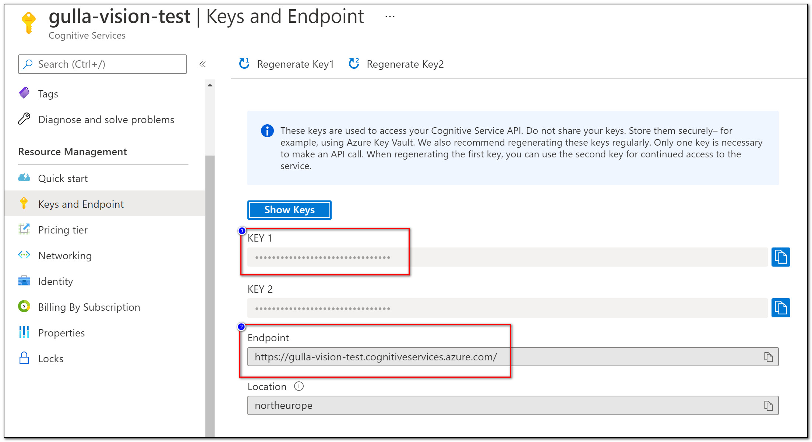
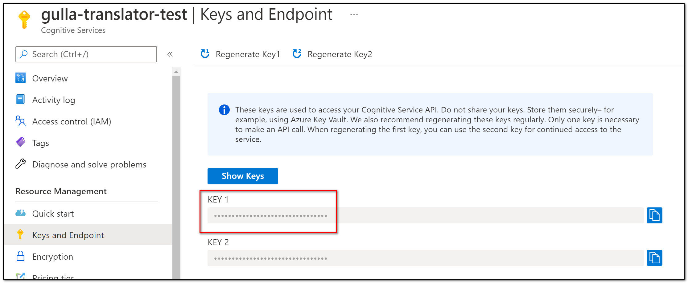

# Gulla.Episerver.AutomaticImageDescription

## 1. Install the addon
The [NuGet package](https://nuget.episerver.com/package/?id=Gulla.Episerver.AutomaticImageDescription) is available on https://nuget.optimizely.com/

## 2. Configuration
For AutomaticImageDescription to work, you will have to call the `.AddAutomaticImageDescription()` extension method in the Startup.ConfigureServices method.
You may pass configuration to the `.AddAutomaticImageDescription()` method or use `appsettings.json` instad. A configuration setting specified in appsettings.json will override any configuration configured in Startup.cs.

## 3. Create a Computer Vision resource
In the Azure portal, create a new resource. Search for «Computer Vision», select pricing tier and create.


## 4. Add Computer Vision Key and Endpoint to config



After the resource is created, locate «Keys and Endpoint» in the left pane and add them to `appsettings.json` like this.
``` JSON
"Gulla": {
  "AutomaticImageDescription": {
    "ComputerVisionSubscriptionKey": "key1",
    "ComputerVisionEndpoint": "https://myendpoint.cognitiveservices.azure.com/"
  }
}
```

## 5. Create a Translator resource
If you are happy with English metadata, you may skip step 3 and 4. If you want your metadata translated to other languages you will need to create a Translator resource. Search for «Translator», select pricing tier and create.


## 6. Add Translator Key to config



After the resource is created, locate «Keys and Endpoint» in the left pane and add the key to the `appsettings.json` like this.
``` JSON
"Gulla": {
  "AutomaticImageDescription": {
    "TranslatorSubscriptionKey": "key2"
  }
}
```

## 7. Add Translator Region to config (optional)
Add your location, also known as region. The default is global. This is required if using a Cognitive Services resource.
``` JSON
"Gulla": {
  "AutomaticImageDescription": {
    "TranslatorSubscriptionRegion": "YOUR_RESOURCE_LOCATION"
  }
}
```

## Summary, all possible configuration
If you prefer `appsettings.json`:
``` JSON
"Gulla": {
  "AutomaticImageDescription": {
    "ComputerVisionSubscriptionKey": "key1",
    "ComputerVisionEndpoint": "https://myendpoint.cognitiveservices.azure.com/"
    "TranslatorSubscriptionKey": "key2"
    "TranslatorSubscriptionRegion": "YOUR_RESOURCE_LOCATION",
    "ScheduledJobMaxRequestsPerMinute": 10
  }
}
```
If you prefer `startups.cs`: 
``` CSHARP
.AddAutomaticImageDescription(x =>
{
    x.ComputerVisionSubscriptionKey = "key1";
    x.ComputerVisionEndpoint = "https://myendpoint.cognitiveservices.azure.com/";
    x.TranslatorSubscriptionKey = "key2";
    x.TranslatorSubscriptionRegion = "YOUR_RESOURCE_LOCATION";
    x.ScheduledJobMaxRequestsPerMinute = 10;
})
```


Now, you are ready to generate metadata!
The next step is to add some [Attributes](https://docs.microsoft.com/en-us/azure/cognitive-services/translator/quickstart-translator?tabs=csharp) to your image model!

[<< Back to readme](../README.md)