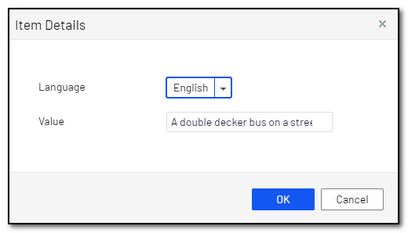
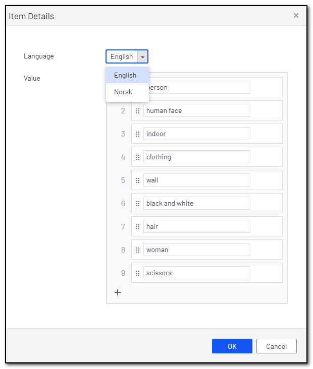

# Localization

Localization can be handled in different ways, because Episerver's base class for images `ImageData` do not implement `ILocalizable` you will have to handle the localization yourselv.

## Option 1 - separate properties
Let's say you want a property for `Description` in three languages, you could add one property for each language that will store the Description in it's respective language. Add a `[AnalyzeImageForDescription]`-attribute to each of the three properties. Add a fourth property that simply returns the content of one of the three other properties based on `ContentLanguage.PreferredCulture.Name`.

You can add all these properties to a block type, and use this block type as a local block on your image model, to group them together. Or you can just add all the properties directly to your image model

See [this blogpost](https://www.gulla.net/en/blog/culture-specific-image-properties-in-episerver/) for code examples.

## Option 2 - localized properties

### Localized strings
Use the property `IList<LocalizedString>` when you want the same string in different languages.

**Example**
``` C#
[AnalyzeImageForDescription(TranslationLanguage.AllActive)]
public virtual IList<LocalizedString> Description { get; set; }
```





### List of localized strings
Use the property `IList<LocalizedString>` when you want the same list of strings in different languages.

**Example**
``` C#
[AnalyzeImageForTags(TranslationLanguage.AllActive)]
public virtual IList<LocalizedStringList> Tags { get; set; }
```





## Translations
When passing the special parameter `TranslationLanguage.AllActive` the value will be translated to all active languages in your site. You can also specify a single language, or more than one language separated by comma.
When manually editing the values, you can choose between all active languages in your site.

## Get the correct translation
You can write your own code to get the correct string, or list of strings, based on your own logic. I would recommnend using `ContentLanguage.PreferredCulture` and perhaps fallback to one specific langauge. Or you can use any of the included `LocalizedStringExtensions`-methods.
- `GetPreferredCulture(this IList<LocalizedString> localizedStrings)`
- `GetPreferredCulture(this IList<LocalizedString> localizedStrings, string fallbackLanguage)`
- `GetPreferredCulture(this IList<LocalizedStringList> localizedStrings)`
- `GetPreferredCulture(this IList<LocalizedStringList> localizedStrings, string fallbackLanguage)`

[<< Back to readme](../README.md)