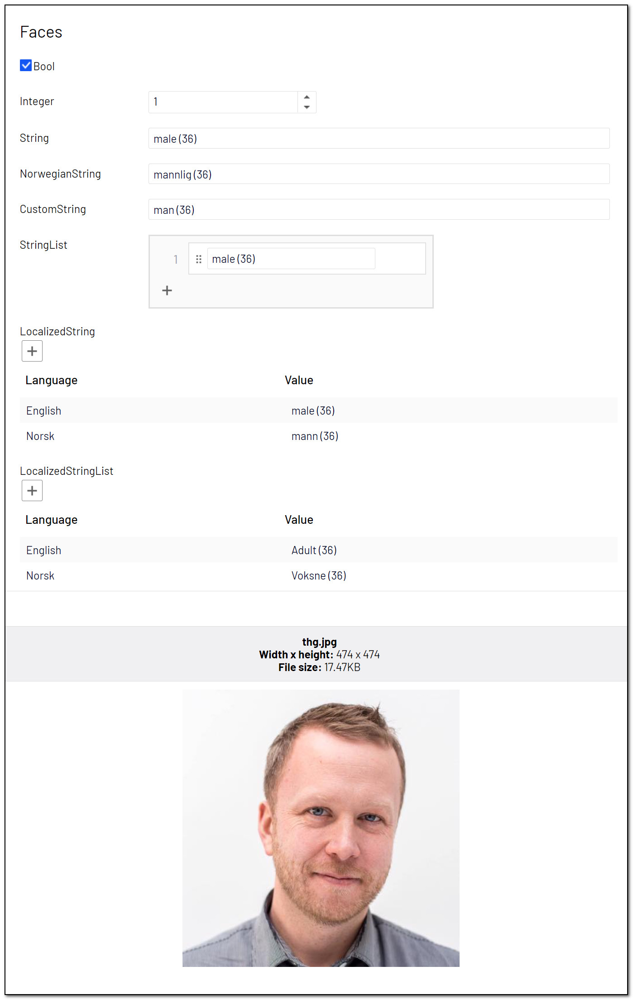

# [AnalyzeImageForFaces]
This attribute will [detect faces](https://docs.microsoft.com/en-us/azure/cognitive-services/computer-vision/concept-detecting-faces), and estimate age and gender for each.

May be added to the following property types:

- **Bool:** True if the image contains one or more faces, False otherwise.
- **Int:** The number of faces.
- **String:** A comma-separated list of gender/age pairs.
- **IList&lt;string&gt;:** A list of gender/age pairs.
- **IList&lt;LocalizedString&gt;:** A comma-separated list of gender/age pairs, in one or more languages.
- **IList&lt;LocalizedStringList&gt;:** A list of gender/age pairs, in one or more languages.

**Parameters**
- **languageCode:** per default, the face description will be in the format «Male (40)». Passing a parameter from the TranslationLanguage-class, you may choose between about 60 different languages. Optional. English is default. Combined with `IList<LocalizedString>` or `IList<LocalizedString>` you can use the language code `TranslationLanguage.AllActive` to get translations for all active languages in your Episerver site, or provide a comma separated list of language codes.

**Alternative parameters**
Male/female are not always the preferred word, or the default translations to your language may not be the best. Maybe children should be differentiated from adults. Use the alternative constructor!

- **maleAdultString:** How to name a male adult, e.g. «Man».
- **femaleAdultString:** How to name a female adult, e.g. «Woman».
- **otherAdultString:** How to name other adults, e.g. «Person».
- **maleChildString:** How to name a male child, e.g. «Boy».
- **femaleChildString:** How to name a female child, e.g. «Girl».
- **otherChildString:** How to name other children, e.g. «Child».
- **childTurnsAdultAtAge:** At what age you consider a person to become an adult.

**Example**
``` C#
public class FaceBlock : BlockData
{
    [AnalyzeImageForFaces]
    public virtual bool Bool { get; set; }

    [AnalyzeImageForFaces]
    public virtual int Integer { get; set; }

    [AnalyzeImageForFaces]
    public virtual string String { get; set; }

    [AnalyzeImageForFaces(TranslationLanguage.Norwegian)]
    public virtual string NorwegianString { get; set; }

    [AnalyzeImageForFaces("man", "woman", "person", "boy", "girl", "child", 18)]
    public virtual string CustomString { get; set; }

    [AnalyzeImageForFaces]
    public virtual IList<string> StringList { get; set; }

    [AnalyzeImageForFaces(TranslationLanguage.AllActive))]
    public virtual IList<LocalizedString> LocalizedString { get; set; }

    [AnalyzeImageForFaces("Adult", "Adult", "Adult", "Child", "Child", "Child", 18, TranslationLanguage.AllActive)]
    public virtual IList<LocalizedStringList> LocalizedStringList { get; set; }
}
```

[<< Back to list of attributes](../Attributes.md)